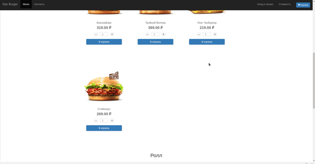

# О приложении

Сайт для сети доставки готовой еды. [Демоверсия](https://lucky0ne.duckdns.org/) реализована на примере сети бургеров. Клиент выбирает продукты, оформляет заказ, указывая адрес куда доставить. При этом не требуется регистрация клиента, для того чтобы избавить клиента от лишних действий. Подразумевается что клиент просто хочет заказать еды, лениво, быстро и просто!
