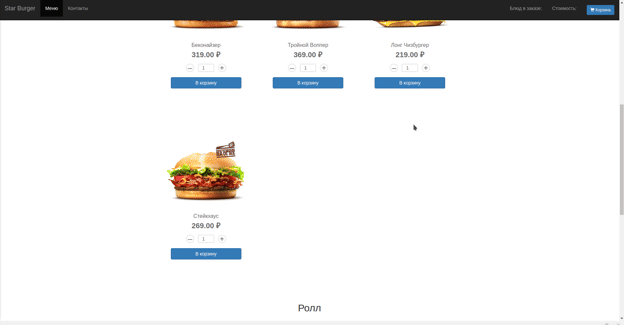
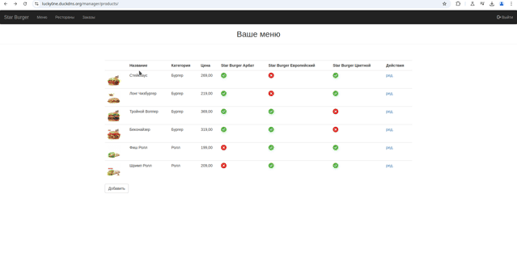
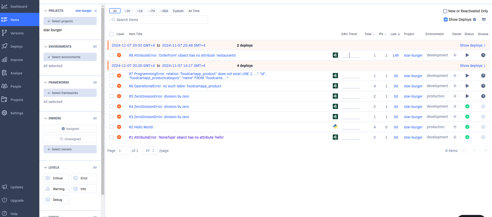

# Star-burger
## О приложении
Сайт для сети доставки готовой еды. [Демоверсия](https://lucky0ne.duckdns.org/) реализована на примере сети бургеров. Клиент выбирает продукты, оформляет заказ, указывая адрес куда доставить.

## [Интерфейс клиента](https://lucky0ne.duckdns.org/) 
Клиенту не нужно регистрироваться для того чтобы заказать. Подразумевается что клиент хочет просто заказать еды, лениво, просто и быстро. Ведь в этом и заключается идея доставки еды. Захотел поесть, выбрал продукты и написал куда доставить.

## [Интерфейс администратора](https://lucky0ne.duckdns.org/manager/orders/)
  
Администратор должен быть зарегистрирован на сайте с пометкой персонала.  
Интерфейс менеджера разбит на три экрана - продукты, рестораны, заказы.  
Администратор имеет возможность просмотра, редактирования, добавления.

## Мониторинг
Приложение настроено для работы с [Rollbar](https://app.rollbar.com/).  
Интерфейс сервиса предоставляет:
 - Экран ошибок
 

